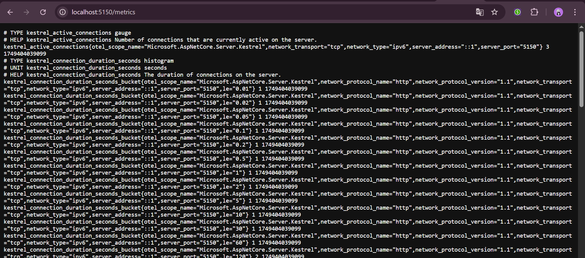
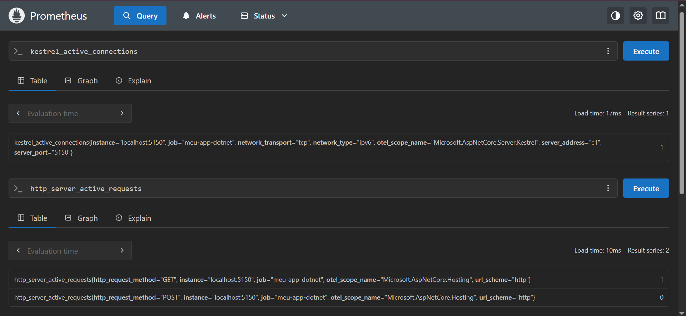
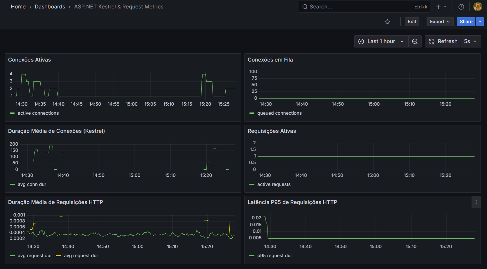

# 📊 Observabilidade com ASP.NET Core 8, Prometheus e Grafana

## Visão geral

Este relatório documenta todo o processo de instrumentação de métricas em uma aplicação ASP.NET Core 8.0, com o objetivo de coletar dados relevantes de performance e expô-los via Prometheus, além de visualizá-los por meio de dashboards interativos no Grafana.

## Etapa 1: Criação e instrumentação da aplicação ASP.NET Core 8

O ponto de partida foi a criação de uma API simples utilizando o template padrão do .NET:

```bash
dotnet new webapi -n WebMetric
```

A aplicação seguiu como base o tutorial oficial da Microsoft para configuração de métricas:
📎 [https://learn.microsoft.com/pt-br/aspnet/core/log-mon/metrics/metrics?view=aspnetcore-8.0](https://learn.microsoft.com/pt-br/aspnet/core/log-mon/metrics/metrics?view=aspnetcore-8.0)

Foram adicionados os pacotes essenciais:

```bash
dotnet add package Microsoft.AspNetCore.Diagnostics.Metrics
dotnet add package OpenTelemetry.Exporter.Prometheus.AspNetCore
```

A seguir, no arquivo `Program.cs`, foi configurada a exportação das métricas com suporte ao Prometheus, além da instrumentação automática do ASP.NET Core e do tempo de execução:

```csharp
builder.Services.AddOpenTelemetry()
    .WithMetrics(metrics =>
    {
        metricsBuilder.AddMeter("Microsoft.AspNetCore.Hosting");
        metricsBuilder.AddMeter("Microsoft.AspNetCore.Server.Kestrel");
        metricsBuilder.AddMeter("Contoso.Web"); 
        metricsBuilder.AddMeter("WebMetric.HttpRequestMetrics");
        metricsBuilder.AddPrometheusExporter();
    });

app.UseOpenTelemetryPrometheusScrapingEndpoint();
```

Após executar o projeto, foi possível acessar as métricas na rota:

```
http://localhost:5150/metrics
```

<div align="center">
  <sub>Métricas encontradas</sub>
  
</div>


## Etapa 2: Execução e configuração do Prometheus

Para coletar e armazenar as métricas expostas pela aplicação, foi utilizado o Prometheus. O processo envolveu:

* Download do Prometheus via site oficial.
* Criação do arquivo `prometheus.yml` com a configuração mínima para capturar dados da aplicação:

```yaml
global:
  scrape_interval: 5s

scrape_configs:
  - job_name: 'prometheus'
    static_configs:
      - targets: ['localhost:']

  - job_name: 'meu-app-dotnet'
    metrics_path: /metrics
    static_configs:
      - targets: ['localhost:5150']
```

O Prometheus foi acessado em:

```
http://localhost:9090
```

Na interface web, foi possível testar as métricas e verificar valores como:

* `kestrel_active_connections`
* `http_server_active_requests`
* `http_server_request_duration_seconds_sum`

<div align="center">
  <sub>Queries Prometheus</sub>
  
</div>

## Etapa 3: Visualização com Grafana

Para tornar os dados coletados mais visuais e interativos, foi utilizado o Grafana, também instalado localmente.

### Dashboard

Foi criado um dashboard customizado contendo painéis para monitorar métricas essenciais da aplicação.

As principais métricas configuradas foram:

| Painel                            | Métrica                                                                                                     |
| --------------------------------- | ----------------------------------------------------------------------------------------------------------- |
| **Conexões Ativas**               | `kestrel_active_connections`                                                                                |
| **Conexões em Fila**              | `kestrel_queued_connections`                                                                                |
| **Duração Média das Conexões**    | `rate(kestrel_connection_duration_seconds_sum[1m]) / rate(kestrel_connection_duration_seconds_count[1m])`   |
| **Requisições Ativas**            | `http_server_active_requests`                                                                               |
| **Duração Média das Requisições** | `rate(http_server_request_duration_seconds_sum[1m]) / rate(http_server_request_duration_seconds_count[1m])` |
| **P95 das Requisições**           | `histogram_quantile(0.95, rate(http_server_request_duration_seconds_bucket[1m]))`                           |

### Importação

Para importar o dashboard:

1. Vá até o Grafana → menu lateral → 📊 **Dashboards** → **Import**
2. Cole o conteúdo do JSON ou selecione o arquivo exportado
3. Vincule à fonte de dados Prometheus
4. Clique em **Import**

<div align="center">
  <sub>Dashboard</sub>
  
</div>

## Conclusão

Através da instrumentação nativa do ASP.NET Core 8 e das integrações diretas com Prometheus e Grafana, foi possível obter um cenário de observabilidade robusto com pouquíssima complexidade de setup. Esse processo mostrou-se eficiente tanto para testes locais quanto para futuras aplicações em ambientes mais estruturados.
